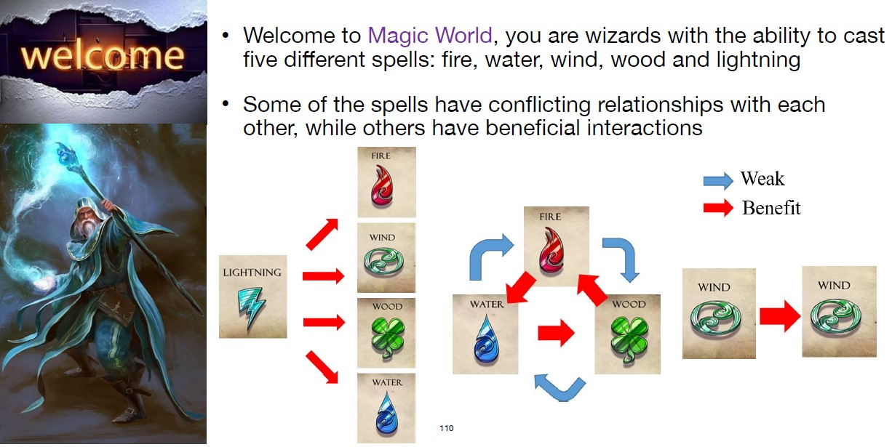
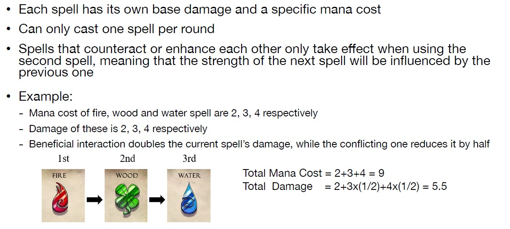
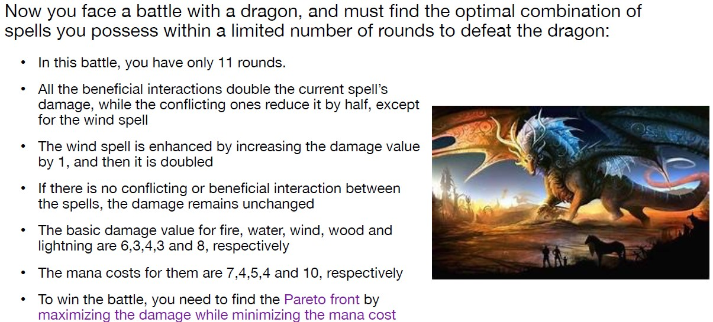

# MagicWorld Problem with Multi-Objective Evolutionary Algorithm

## Problem
<div align="center">
    <a href="./">
        
    </a>
</div>

<div align="center">
    <a href="./">
        
    </a>
</div>

<div align="center">
    <a href="./">
        
    </a>
</div>

## Solutions

### MOEA with NSGA-II non-dominated front ranks

I utilize EA to form the solution steps. There are Initialization, Parent Selection, Crossover/Recombination, Mutation and Survivor Selection.
Now we breakdown the process into these steps.

### Initialization
```shell
Using Parser library feed the Input Data with magic_example.cfg then initialize whole population with randomness.
```

### Parent Selection
```shell
Using Binary-Tournament:
    -- Tournament pairs should be randomly selected
    -- All individuals from initial population should participate in exactly 2 tournaments
```

### Crossover / Recombination
```shell
Perform uniform crossover. Literally go through each gene that the individual has, then randomly decides to change with another individual or not.
```

### Mutation
```shell
Adopt self-adaptive mutation with uncorrelated mutation with single sigma.
```

## Right before the survivor selection:
Here we perform the NSGA-II method to identify the pareto-optimal front of Multi-objectives proble.

1. Computes the Crowding distance of all individuals with K-th nearest-neighbor with normalized distance approach.
2. Computes the Front-Ranks according to the non-dominated front method (NSGA-II).

### Dominate ?
```shell
If both of the following conditions are true, then solution x is said to “dominate” solution y:
1. Solution x is no worse than y in all objectives
2. Solution x is strictly better than y in at least one objective
```

### Non-dominated front of multi-objective:
```shell
1.Use standard non-domination sorting to find “first” (best) Pareto front (non-dominatedset) from current population
2.Remove the discovered Pareto front members from the population
3.Go back to step #1 and repeat again. Iterate until all population members have been exhausted
```

### Survivor Selection
```shell
Truncation selection. -- Elitist(mu+mu) generational-with-overlap EA.
1.Sorting with Non-dominated front.
2.Sorting with Crowding distance.
3.Truncation selection.
```


